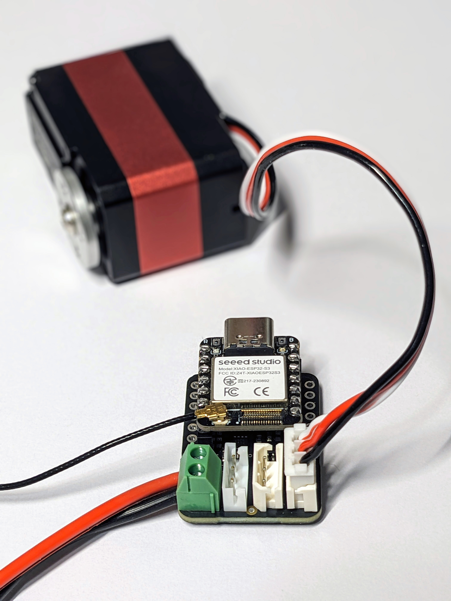
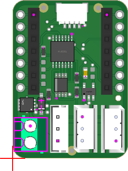
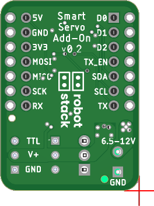
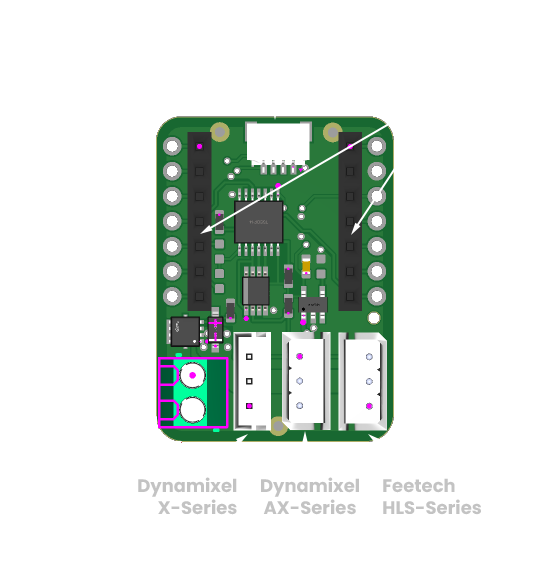
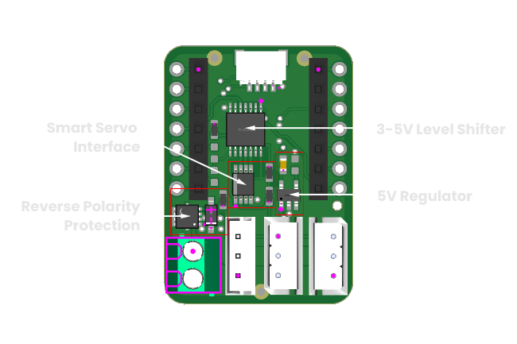

# Smart Servo Add-on Board

This repository contains the hardware design files and documentation for the Smart Servo Add-On Board.

[**Buy on Tindie**](https://www.tindie.com/products/robotstack/smart-servo-addon-board/)

> **Note:** This is an early version of the board. While it has been tested with several servo models, bugs may exist. Please report any issues you encounter.

## Description

This board allows wireless control different TTL smart servos. I developed it to use with Seeed's Xiao esp32-s3 Microcontroller, but it should also work with Adafruit's QT-Py esp32-s3, and likely other esp32s. I've tested it with the following smart servos: Robotis XL430-W250, AX-12W, Feetech HL3930M, and briefly with Waveshare's ST3215. Firmware and Control Software are available in the links below.

    

## Features

- Wireless Control of Smart Servos
- Compatible with Seeed Xiao and Adafruit QT-Py Form Factor
- Connectors for:

  - Dynamixel X-Series
  - Dynamixel AX-Series
  - Feetech HLS-Series / Waveshare ST3215

  > (Likely compatible with other smart servos; check your servo's specs)

- Stemma QT / QWIIC connector for compatible daughter boards (ie. sensors)
- Breakout pins
- 6.5 to 12 Volt Supply Range (check servo documentation for requirements)
- On board 5V regulator for Microcontroller
- Reverse Polarity Protection
- Firmware and Control Software available

## Hardware Overview

The pinouts are determined by the microcontroller you use. This board was designed to be used with the Seeed Xiao ESP32-S3 or the Adafruit QT Py ESP32-S3. See their documentation for details.

> **Important**: Check your servo connector's pinouts before connecting! Connecting to the wrong connector could damage the board and your servo.

    
    

    

    

## Getting the Board

### Pre-assembled

Pre-assembled boards are available for purchase on Tindie:
[Buy on Tindie](https://www.tindie.com/products/robotstack/smart-servo-addon-board/)

### DIY

You can build this board yourself using the hardware design files in this repository.

## Firmware

Example firmware for this board is available in a separate Arduino library. You can find it here:
[Smart Servo Bridge](https://github.com/robotstack-dev/smart-servo-bridge)

The library can be used with or without this addon board, making it flexible for different applications.

## Control Software

Python SDKs enabling wireless control of your smart servos are available. They require use of these boards implementing the [Smart Servo Bridge](https://github.com/robotstack-dev/smart-servo-bridge) library, or similar:

- [FTServo Python Websockets](https://github.com/robotstack-dev/ftservo-python-websockets)
- [Dynamixel Python SDK Websockets](https://github.com/robotstack-dev/dynamixel-python-sdk-websockets)

Other smart servos will require similar modifications to their SDKs.

## Getting Started

1. Build or purchase the circuit.
2. Attach a Microcontroller (eg. Seeed Xiao esp32-s3, or Adafruit QT Py esp32-s3).
3. Upload firmware over USB.
4. Attach your smart servo to the correct connector, according to your servo pinout.
5. Attach a power supply between 6.5 and 12 Volts, according to your servo requirements.
6. Run one of the control software examples that corresponds with your servo.

## Contributing

Contributions are welcome! Here are some guidelines to help you get started:

### How to Contribute

1. Fork the repository and create your branch from `master`.
2. Clone your fork and make your changes.
3. Test your changes if possible.
4. Submit a pull request with a clear description of your changes.

### Code of Conduct

- Be respectful and considerate in your communications.
- Assume good intentions and be constructive in feedback.

### Reporting Issues

- Use the issue tracker to report bugs or request features.
- Provide as much detail as possible (steps to reproduce, expected behavior, etc.).

## Author

Nicholas Stedman

- [GitHub](https://github.com/nsted)
- [Tindie Store](https://www.tindie.com/stores/robotstack/)

## License

This project is licensed under the MIT License - see the [LICENSE.txt](LICENSE.txt) file for details.
